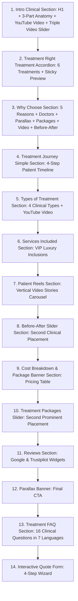

# 🏛️ Master Smile Studio — Master Architecture, i18n & CSS Specification Guide

> **🚨 MANDATORY COMPLIANCE DIRECTIVE FOR ALL AI AGENTS & DEVELOPERS**
> **DO NOT IMPROVISE. DO NOT USE CREATIVE LIBERTIES. DO NOT GUESS OR ESTIMATE.**
> This repository follows a strict, deterministic, enterprise-grade architecture. Every AI coding assistant (including Antigravity, Claude, ChatGPT, Gemini, Cursor) must **strictly and verbatim** execute tasks according to the patterns, folder structures, design tokens, and naming conventions defined in this manual.

---

## 📑 Complete Architectural Blueprint

1. [Lead Architect Operating Philosophy & Behavioral Directives](#1-lead-architect-operating-philosophy--behavioral-directives)
2. [Zero-Tolerance Operational Rules](#2-zero-tolerance-operational-rules)
3. [Treatment Page 15-Part Golden Master Architecture](#3-treatment-page-15-part-golden-master-architecture)
4. [Current Implementation Inventory & Route Map](#4-current-implementation-inventory--route-map)
5. [Strict Modular i18n Architecture (7 Locales)](#5-strict-modular-i18n-architecture-7-locales)
6. [Pure CSS Modules & Design Token System](#6-pure-css-modules--design-token-system)
7. [Navigation, URL Routing & Technical SEO Invariants](#7-navigation-url-routing--technical-seo-invariants)
8. [Interactive Components & Client-Side Safety Rules](#8-interactive-components--client-side-safety-rules)
9. [Multi-Locale Pre-flight Verification Protocol](#9-multi-locale-pre-flight-verification-protocol)
10. [Prohibited Anti-Patterns Checklist](#10-prohibited-anti-patterns-checklist)

---

## 1. 👑 Lead Architect Operating Philosophy & Behavioral Directives

The lead architect and project owner operates under a clear, uncompromising engineering and business standard:

### 🛠️ 1. Pragmatic Control & Zero "Looks Like It Works" Illusions
* Superficial implementations that look functional on the surface but fail on edge cases, mobile viewports, or production deployments are strictly unacceptable.
* Every component, handler, state, and responsive rule must be bulletproof, type-safe, and tested.

### 🌍 2. Health Tourism & Global Conversion Funnel Mastery
* The target demographic is international dental tourism patients from the UK, Germany, Poland, Portugal, Spain, Russia, Turkey, and worldwide.
* **Zero Linguistic Laziness:** Any shortcut (e.g. shortening translations, omitting clinical details in Polish or Portuguese, leaving binary English fallbacks) directly damages the conversion funnel.
* All 7 languages (`en`, `tr`, `de`, `pl`, `pt`, `es`, `ru`) MUST receive 100% equal medical depth, full paragraphs, and all 16 clinical FAQs.

### 📐 3. Design System & 15-Part Master Architecture Enforcement
* The 15-part golden master structure established in `DentalImplantsDetailView.tsx` is strict law.
* It ensures systematic modularity, high patient trust, premium luxury aesthetics, and scalability as the studio grows.
* "AI slop", dashed placeholder boxes (`MediaPlaceholder`, `#Video 1`), and arbitrary styling are strictly prohibited.

### 🔍 4. Technical SEO, Indexing & Core Web Vitals
* Direct, clean URLs (`/treatments/dental-crowns`, `/treatments/dental-bridge`) are mandatory. Anchor hacks (`/treatments#crowns`) are forbidden.
* Semantic HTML5 (`<h1>`, `<section aria-labelledby="...">`, `<main>`), JSON-LD Schema.org graphs, and fluid typography (`clamp(...)`) ensure maximum search ranking and fast loading.

### 🛡️ 5. Systems Integrity & Senior Developer Discipline
* **Respect Existing Architecture:** Never invent arbitrary patterns or re-implement existing components from scratch. Build incrementally upon the proven codebase.
* **Zero Hallucination / Zero Guesswork:** Verify every path, CSS class, and route with automated verification commands.
* **Direct, Result-Oriented Execution:** Immediate focus on clean, high-precision code and concrete outputs.

---

## 2. 🛑 Zero-Tolerance Operational Rules

| Rule | Mandate | Consequence of Violation |
| :--- | :--- | :--- |
| **1. Never Reduce/Summarize Content** | **100% of authentic medical/clinical copy must be preserved.** Every anatomical breakdown, table row, clinical reason, and 16 FAQ answers must be fully translated and kept intact. | Immediate task failure and rejection. |
| **2. Pure CSS Modules for EVERY Section** | **Every single section/component created MUST have its own `[SectionName].module.css`.** Never use inline styles or raw Tailwind classes. | Layout breakage, style bleed, floating buttons. |
| **3. 7-Language i18n for EVERY Section** | **Every new section MUST provide translations for all 7 languages (`en`, `tr`, `de`, `pl`, `pt`, `es`, `ru`).** Never hardcode strings in TSX. | Broken multi-locale user experience. |
| **4. Relative Anchor Rule** | **Any element containing `position: absolute` children MUST have `position: relative;` declared directly on its CSS class in the module.** | Absolute elements jumping to page top/hero. |
| **5. Zero Build Errors & Clean Routes** | Every change must pass `npm run build` with **0 TypeScript and 0 Next.js errors (Exit Code: 0)** and return HTTP 200 across all 7 locales. | Production deployment failure. |

---

## 3. 📐 Treatment Page 15-Part Golden Master Architecture

Every treatment master detail page MUST strictly follow this exact 15-part section flow:



### Detailed Component Sequence:
1. **`introSection`**: Main `<h1>` title, lead paragraph, 3-part anatomy breakdown with `<strong>`, healing & solution paragraphs, full-width YouTube video iframe (`R081L98DAls`), `TreatmentDivider`, and `TreatmentTripleVideoSlider`.
2. **`Treatment[Category]RightTreatmentAccordion`**: 2-column layout (`surfaceCard`) with 6 treatment cards on the left and sticky preview card with real clinical photography on the right.
3. **`whyChooseSection`**: 5 numbered clinical reasons integrating:
   - `TreatmentDoctorsSection`
   - `TreatmentParallaxBanner`
   - `Treatment[Category]PackagesSlider`
   - Full-width CAD/CAM lab video (`K4Xpx7JMyr8`)
   - `Treatment[Category]BeforeAfterSliderSection`
4. **`TreatmentJourneySimpleSection`**: 4-step treatment timeline.
5. **`typesSection`**: Detailed clinical breakdown of 4 types + video embed (`smhwCD78Vbo`).
6. **`TreatmentServicesIncludedSection`**: VIP luxury inclusions (5★ Hotel, Mercedes Chauffeur, 3D CBCT, Translation).
7. **`TreatmentPatientReelsSection`**: Vertical video reels of real patients.
8. **`Treatment[Category]BeforeAfterSliderSection`**: Second clinical placement.
9. **`TreatmentCostBreakdownAndPackageBannerSection`**: Cost comparison table & promo banner.
10. **`Treatment[Category]PackagesSlider`**: Second placement.
11. **`TreatmentReviewsSection`**: Google & Trustpilot review widgets.
12. **`TreatmentParallaxBanner`**: High-conversion parallax CTA.
13. **`Treatment[Category]FAQSection`**: 16 in-depth clinical FAQs in all 7 languages.
14. **`TreatmentInteractiveQuoteForm`**: 4-step wizard with `defaultTreatment`.

---

## 4. 🗺️ Current Implementation Inventory & Route Map

| # | Treatment Category | Main URL | Sub-Routes Connected | Master View Component | Language Status |
|---|---|---|---|---|:---:|
| 1 | **Dental Implants** | `/treatments/dental-implants` | `/all-on-4-implants`, `/all-on-6-implants`, `/immediate-implants`, `/zygomatic-implants`, `/zirconium-implants`, `/sinus-lifting` | `DentalImplantsDetailView.tsx` | ✅ 7 Locales |
| 2 | **Dental Crowns** | `/treatments/dental-crowns` | `/zirconium-crowns`, `/emax-crowns`, `/pfm-crowns`, `/full-ceramic` | `DentalCrownsDetailView.tsx` | ✅ 7 Locales |
| 3 | **Dental Veneers** | `/treatments/dental-veneers` | `/porcelain-veneers`, `/emax-veneers`, `/zirconium-veneers`, `/composite-veneers`, `/lumineers`, `/empress-veneers` | `DentalVeneersDetailView.tsx` | ✅ 7 Locales |
| 4 | **Dental Bridge** | `/treatments/dental-bridge` | `/traditional-bridges`, `/maryland-bridges`, `/cantilever-bridges` | `DentalBridgeDetailView.tsx` | ✅ 7 Locales |
| 5 | **Dentures** | `/treatments/dentures` | `/complete-dentures`, `/partial-dentures`, `/overdentures`, `/snap-on-dentures` | `DenturesDetailView.tsx` | ✅ 7 Locales |
| 6 | **Cosmetic Dentistry** | `/treatments/cosmetic-dentistry` | `/smile-makeover`, `/hollywood-smile`, `/gummy-smile`, `/teeth-whitening`, `/tooth-contouring`, `/diastema-closure` | `CosmeticDentistryDetailView.tsx` | ✅ 7 Locales |
| 7 | **General Dentistry** | `/treatments/general-dentistry` | `/root-canal-treatment`, `/teeth-cleaning-scaling`, `/dental-fillings`, `/tooth-extractions`, `/periodontology` | `GeneralDentistryDetailView.tsx` | ✅ 7 Locales |

---

## 5. 🌐 Strict Modular i18n Architecture (7 Locales)

Every component must declare its strongly-typed dictionary containing all 7 active locales:

```tsx
interface TreatmentI18n {
  title: string;
  subText: string;
  items: Array<{ q: string; a: string }>;
}

const FAQ_DATA: Record<string, TreatmentI18n> = {
  en: { title: '...', subText: '...', items: [ /* 16 items */ ] },
  tr: { title: '...', subText: '...', items: [ /* 16 items */ ] },
  de: { title: '...', subText: '...', items: [ /* 16 items */ ] },
  pl: { title: '...', subText: '...', items: [ /* 16 items */ ] },
  pt: { title: '...', subText: '...', items: [ /* 16 items */ ] },
  es: { title: '...', subText: '...', items: [ /* 16 items */ ] },
  ru: { title: '...', subText: '...', items: [ /* 16 items */ ] },
};
```

---

## 6. 🎨 Pure CSS Modules & Design Token System

* Every component MUST have its companion `[ComponentName].module.css` file.
* **Strict prohibition against inline styles (`style={{ ... }}`) or Tailwind utilities.**
* Use CSS design tokens for consistency:
  - Gold Accent: `#D58936` / `#b87328`
  - Dark Primary: `#0c1b4d` / `#0f172a`
  - Body Text: `#475569` / `#64748b`
  - Surface Background: `#ffffff` / `#f8fafc`
  - Borders: `#e2e8f0` / `#cbd5e1`

---

## 7. 🚦 Multi-Locale Verification Protocol

Before completing any task, run the automated verification command across all locales:

```bash
curl -s -o /dev/null -w "EN:%{http_code}\n" http://localhost:3000/en/treatments/[slug] && \
curl -s -L -o /dev/null -w "TR:%{http_code}\n" http://localhost:3000/tr/treatments/[slug] && \
curl -s -o /dev/null -w "DE:%{http_code}\n" http://localhost:3000/de/treatments/[slug] && \
curl -s -o /dev/null -w "PL:%{http_code}\n" http://localhost:3000/pl/treatments/[slug] && \
curl -s -o /dev/null -w "PT:%{http_code}\n" http://localhost:3000/pt/treatments/[slug] && \
curl -s -o /dev/null -w "ES:%{http_code}\n" http://localhost:3000/es/treatments/[slug] && \
curl -s -o /dev/null -w "RU:%{http_code}\n" http://localhost:3000/ru/treatments/[slug]
```

All requests must return **HTTP 200**.
